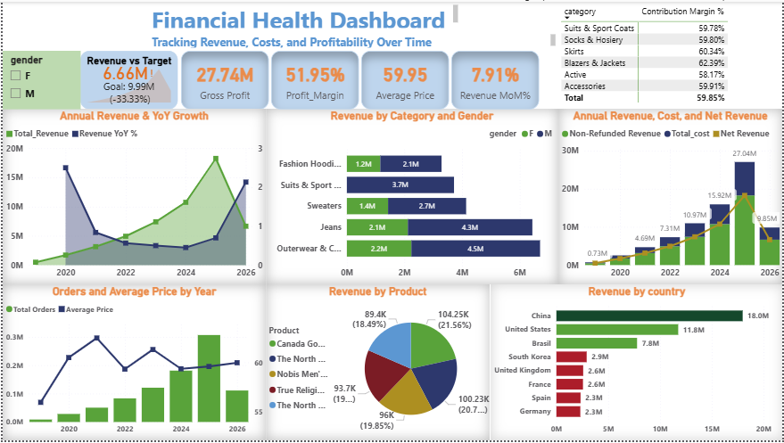

# E-Commerce Financial & Customer Analytics

End-to-end Business Intelligence solution integrating financial performance analytics with customer behavior modeling using BigQuery and Power BI.

---

## Overview
 

Designed and implemented a scalable BI framework that transforms raw transactional e-commerce data into an executive-ready decision support system.

The solution combines financial KPI architecture with RFM segmentation and churn analytics to enable proactive, data-driven strategy.

---

## Architecture

**Data Flow:**  
BigQuery (SQL Transformation Layer) → Star Schema Model → DAX Measures → Power BI Dashboards

**Core Model:**
- Fact: `fact_sales`
- Dimensions: `dim_product`, `dim_customer`, `dim_date`, `dim_geography`, `dim_brand`
- Single-direction filtering
- No many-to-many joins
- Optimized for time intelligence performance

**Behavioral Layer:**
- Customer RFM scoring
- Segment classification (Champions, Loyal, At-Risk, Lost, New)
- Monthly churn tracking
- Revenue loss due to churn calculation

---

## Data Engineering

### SQL (BigQuery)
- Data trimming and standardization
- Duplicate removal via `ROW_NUMBER()`
- Null and integrity validation
- Outlier detection (Z-score / IQR)
- Analytical views for segmentation and churn modeling

### Power BI
- Star schema modeling
- Calculated columns (Revenue, Net Revenue, Profit)
- Advanced DAX (YoY, YTD, churn rate, margin %)
- KPI reconciliation and governance validation

---

## KPI Framework

**Financial**
- Total Revenue & Net Revenue
- Gross Profit & Contribution Margin (~52%)
- YoY Growth %
- Average Order Value
- Refund Impact

**Customer**
- Total & Active Customers
- Churn Rate (~83%)
- Revenue by Segment
- Revenue by Channel
- Revenue Lost to Churn

---

## Key Insights

- Revenue growing with moderate volatility
- High-margin categories drive profitability
- Revenue concentrated in China, US, Brazil
- Champions represent 38% of revenue base
- At-Risk customers 34% (retention vulnerability)
- Women’s department contributes 57% of revenue
- Search & Organic outperform Display channels

---

## Strategic Impact

- Improved financial transparency
- Quantified churn-driven revenue risk
- Enabled segment-based revenue optimization
- Shifted organization from reactive reporting to proactive decision-making

---

## Skills Demonstrated

Star Schema Modeling | SQL (BigQuery) | RFM Segmentation | Churn Analytics | Advanced DAX | Financial KPI Design | Executive Dashboard Development
